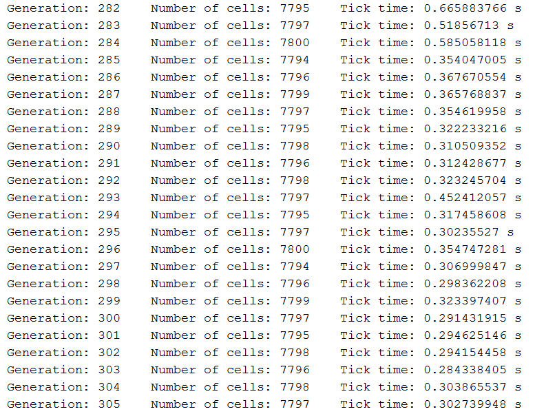
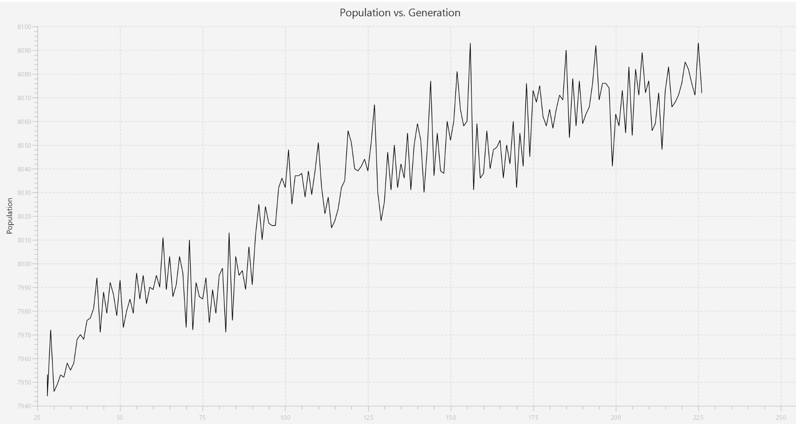
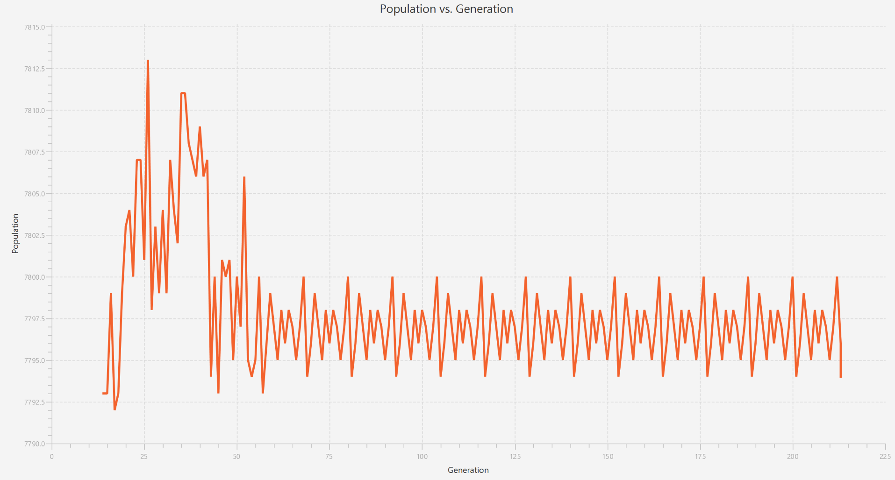
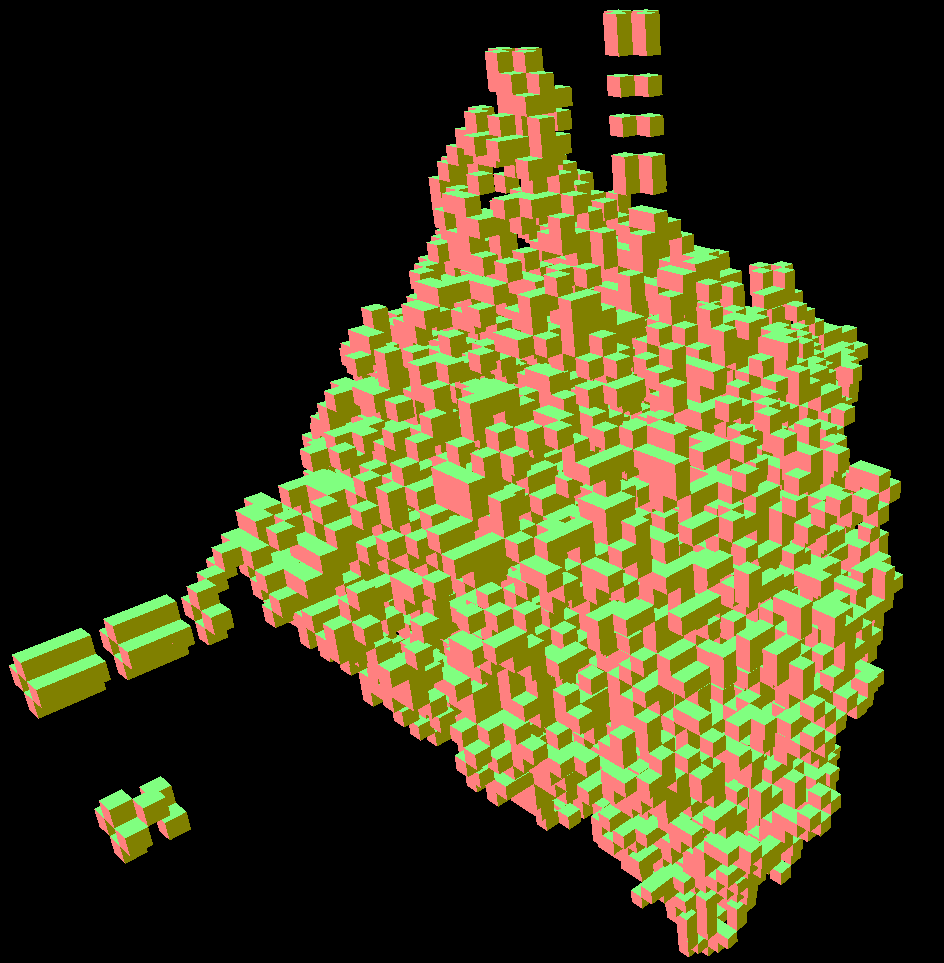

# JLife
Three dimensional cellular automata.

## Usage:
Currently, only server is (partially) implemented. To run it, execute *src/server/ui/ServerApp.java*.

Also, a small demo of the 3D gui is awailable at *src/application/Main.java*. It works on its own, you don't have to start a server to run it.

## Current Progress:
* Under development

## Screenshots (Yay!):
#ConsoleUI:

#GraphGUI:

#VisualUI:

Game Of Life rules:

Nicer graphics:

### Chunk is:
* Set<Trail< Node>> *nodes*
* Position *p1*
* Position *p2*
* Position *p3*

----------
Denotes a group of nodes whose future state can be computed without the
need to access other chunks (in general).
* *nodes* describes nodes in this chunk that was before and that can
  come after (positions are relative)
* *p1*, *p2*, *p3* are the corners of the bounding box of the chunk
  (changing the order of these corners rotates the chunk)

### Trail is one of:
* * Trail *previous*
  * Trail *next*
* EmptyTrail
A state of the chunk in terms of its node composition. A future of the
chunk is computed by accessing the next trail (if chunks don't collide).
A lot of recomputation can be avoided by reusing trails.

Accessible methods:
* next()

----------
* *previous* is the previous trail
* *next* is the next trail

### Node is:
Describes a node.
* Position *p*

----------
* *p* is the position of the node in the world

### Position is:
A position in the 3D space (for now, perfectly Euclidean).
* int x
* int y
* int z

----------
* *x*, *y*, *z* denote global coordinates

## Server
Does all the computations.

## Clients
Connect to the server to retrieve current world state.

### VisionGUI
3D gui for the representation of the world state.

* Can fly around in the world.
* Cells are represented by cubes.
* Chunks far away will be merged into cubes to reduce polygon count.
* Can see positions of other clients / char with them.
* World edit (Create personalized chunks?
  Stop time of those chunks during the edit?)

### StatisticsGUI
2D gui with statistics information about the world state.

* Total number of cells
* Cell density
* Number of chunks
* Tick delay
* Number of clients
* ... Other server controls and stats
